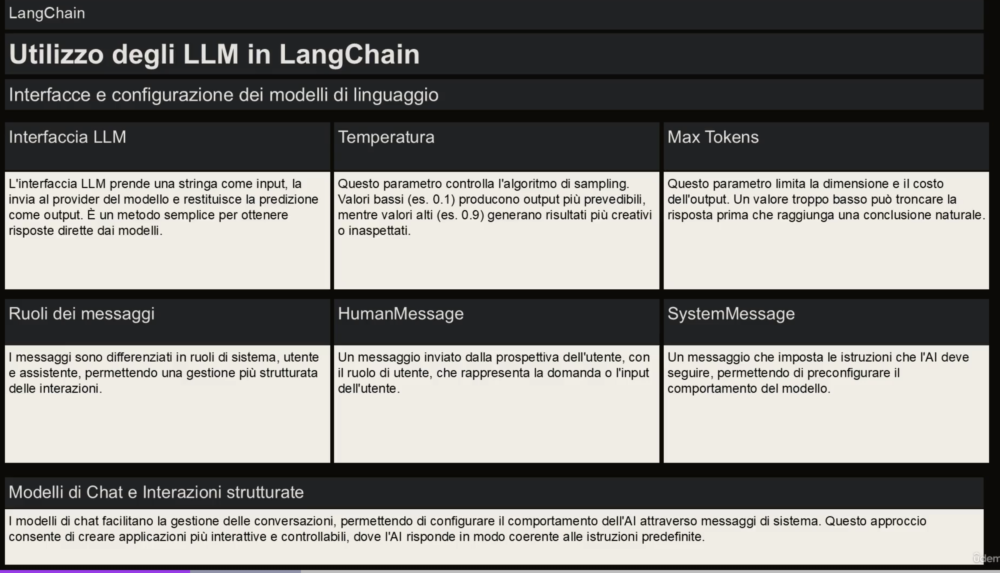

# Langchain 

## Cos'è LangChain?
1. Libreria per semplificare l'utilizzo di diversi LLM con una interfaccia comune
2. Template: Collezione di referenze architetturali per risolvere un task specifico (chatbot) un caso è LLamaindex
3. LangServe: Serve un LLM in modo da poterlo interrogare via API REST
4. LangSmith: Piattaforma di sviluppo
5. LangChainHub: Repository di prompt preconfezionati per usi comuni, posso usarli referenziandoli come fossero macchine docker così da non doverli copiare in locale

In poche parole con LangChain, scrivi le tue applicazioni utilizzando le librerie e facendo riferimento ai template come guida. LangSmith ti aiuta poi a ispezionare, testare e monitorare le tue catene. Infine, con LangServe puoi facilmente trasformare qualsiasi catena in un'API, rendendo il deployment semplice e immediato.

## Crezione modelli
I modelli vengono creati tramite moduli, che possono essere standalone o composti, le tipologie sono:
1. Model I/O: facilita l'interazione con vari modelli linguistici, gestendo in modo efficiente gli input e gli output.
1.Retrieval: consente l'accesso e l'interazione con i dati specifici del l'applicazione, il che è essenziale per un uso dinamico dei dati.
1. Agenti: permette all'applicazione di selezionare il tool corretto in base alle direttive ricevute, migliorando le capacità decisionali.
1. Chains: offre composizioni predefinite e riutilizzabili che fungono da blocchi per lo sviluppo di applicazioni.
1. Memory: mantiene lo stato dell'applicazione su più esecuzioni, essenziali per le interazioni sensibili al contesto.

Inoltre ho LangChain Expression Language (LCEL) che permette di concatenare moduli in modo programmatico. AE:

```
from langchain.chat_models import ChatOpenAI
from langchain.prompts import ChatPromptTemplate
from langchain.schema import CustomOutputParser
chain = ChatPromptTemplate() | ChatOpenAI() | CustomOutputParser()
```

## Model I/O
E' il modulo base di ogni applicazione. E' composto da:

1. **LLMs e Chat Models** (usati intercambiabilmente):
   * **LLMs**:
     * Definizione: Modello puro di linguaggio, progettato per generare testo in base a un input testuale.
     * Input/Output: Accettano un testo come input e restituiscono un testo come output. 
   * **Chat Models**
     * Definizione: Modello che usa un LLM come base ma può differire negli input e output.
     * Input/Output: Accettano una lista di messaggi di chat come input e restituiscono un Chat Message come output.
1. **Prompts**: Templatizzano, selezionano e gestiscono gli input del modello. Permettono di creare prompt flessibili e specifici per il contesto che guidano le risposte del modello di linguaggio.
   * Prompt Templates: Modelli di prompt predefiniti che possono essere riutilizzati e personalizzati per vari casi d'uso.
   * Few-Shot Prompts: Includono esempi nel prompt per guidare il modello verso risposte più accurate.
   * Chat Prompt Templates: Strutture per gestire conversazioni complesse, consentendo l'invio di messaggi multipli in un formato strutturato.
1. **Output Parsers**: Estraggono e formattano le informazioni dagli output del modello. Utili per convertire l'output grezzo dei modelli di linguaggio in dati strutturati o formati specifici necessari dall'applicazione.

### LLM
Langchain non hosta un LLM ma si collega ad altri servizi che lo fanno, come OpenAI, HuggingFace, Cohere, Anthropic, Google PaLM e altri.

Gli oggetti LLM implementano l'interfaccia Runnable con una serie di metodi (invoke, stream, batch, ...) che prendono come input stringhe o oggetti strutturati che possono essere convertiti in stringa.

Vedi `LLM.py`
### Chat Models
I Chat Model sono una variante dei LLM progettati per gestire conversazioni e interazioni più complesse.
Internamente, i modelli di chat utilizzano un LLM come base, ma differiscono nella loro interfaccia e nel modo in cui gestiscono gli input e gli output. 

I messaggi più usati sono: HumanMessage, AIMessage, SystemMessage, ma esistono anche FunctionMessage e ChatMessage per gestire le interazioni.

In input accettano: List[BaseMessage], gli HumanMessage possono essere creati partendo da una stringa plain

Vedi `ChatModel.py`

### Prompt templates
I template sono tecnicamente nel caso più semplice stringhe parametriche, ma ho vari metodi per costruirli. Permettono di descrivere un prompt in modo strutturato e di riutilizzarlo in vari contesti.

es:
`Tell me a {adjective} joke about {content}.`

Nel caso dei ChatModel i prompt sono più strutturati in quanto devo descrivere anche il ruolo del messaggio

Vedi `Template.py`

### Output parser
Sono una parte fondamentale di LangChain, in quanto consentono di estrarre e formattare le informazioni dagli output dei modelli di linguaggio.

Alcuni parser comuni includono: PydanticOutputParser, SimpleJsonOutputParser, CommaSeparatedListOutputParser, DatetimeOutputParser, and XMLOutputParser


See: https://nanonets.com/blog/langchain/#understanding-langchain
https://nanonets.com/blog/llamaindex/

LangChain è una libreria progettata per semplificare lo sviluppo di applicazioni basate su modelli di linguaggio (LLM). 
Fornisce strumenti e astrazioni per combinare modelli di linguaggio con altre fonti di dati, flussi di lavoro complessi e interazioni strutturate.

### Vantaggi rispetto all'uso diretto delle primitive di un LLM:
1. **Gestione della memoria**: LangChain consente di mantenere uno stato conversazionale (memoria) tra le interazioni, utile per chatbot o applicazioni che richiedono contesto persistente.

2. **Integrazione con fonti di dati esterne**: Supporta l'accesso a documenti locali, database o API per arricchire le risposte del modello con informazioni aggiornate o specifiche.

3. **Pipeline modulari**: Permette di creare flussi di lavoro complessi combinando modelli di linguaggio con altre funzionalità, come il recupero di documenti o l'esecuzione di codice.

4. **Prompt engineering semplificato**: Fornisce strumenti per costruire, gestire e ottimizzare i prompt in modo strutturato.

5. **Strumenti avanzati**: Include funzionalità come agenti (per eseguire task complessi) e catene (per orchestrare sequenze di operazioni).

6. **Scalabilità e riutilizzabilità**: Le catene e gli agenti possono essere facilmente riutilizzati e scalati per applicazioni più grandi.

In sintesi, LangChain riduce la complessità dello sviluppo, migliorando la produttività e consentendo di creare applicazioni più potenti e modulari rispetto all'uso diretto delle API di un LLM.



* Interfaccia LLM: da un'interfaccia comune per i vari LLM
* Ruoli: l'interfaccia permette di distinguere gli input. 
  * Sistema da il contesto
  * Utente da la richiesta
  * Assistente è utilizzato per il contenuto generato dal modello (TBD)
* L'interfaccia invia non solo il prompt ma diversi messaggi associati a ogni ruolo
  * HumanMessage: messaggio inviato dall'umano col ruolo utente
  * HiMessage: messaggio inviato dall'IA con cui l'uomo interagisce col ruolo assistente
  * SystemMessage: imposta le istruzioni che deve seguire il modello col ruolo sistema, posso usarla per preconfigurare l'IA così che guido il comportamento del modello avendo una risposta prevedibile.
  * ChatMessage: consente l'impostazione arbitraria di un ruolo
