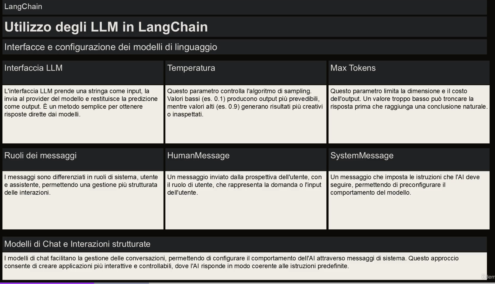

# Langchain 

LangChain è una libreria progettata per semplificare lo sviluppo di applicazioni basate su modelli di linguaggio (LLM). 
Fornisce strumenti e astrazioni per combinare modelli di linguaggio con altre fonti di dati, flussi di lavoro complessi e interazioni strutturate.

### Vantaggi rispetto all'uso diretto delle primitive di un LLM:
1. **Gestione della memoria**: LangChain consente di mantenere uno stato conversazionale (memoria) tra le interazioni, utile per chatbot o applicazioni che richiedono contesto persistente.

2. **Integrazione con fonti di dati esterne**: Supporta l'accesso a documenti locali, database o API per arricchire le risposte del modello con informazioni aggiornate o specifiche.

3. **Pipeline modulari**: Permette di creare flussi di lavoro complessi combinando modelli di linguaggio con altre funzionalità, come il recupero di documenti o l'esecuzione di codice.

4. **Prompt engineering semplificato**: Fornisce strumenti per costruire, gestire e ottimizzare i prompt in modo strutturato.

5. **Strumenti avanzati**: Include funzionalità come agenti (per eseguire task complessi) e catene (per orchestrare sequenze di operazioni).

6. **Scalabilità e riutilizzabilità**: Le catene e gli agenti possono essere facilmente riutilizzati e scalati per applicazioni più grandi.

In sintesi, LangChain riduce la complessità dello sviluppo, migliorando la produttività e consentendo di creare applicazioni più potenti e modulari rispetto all'uso diretto delle API di un LLM.

